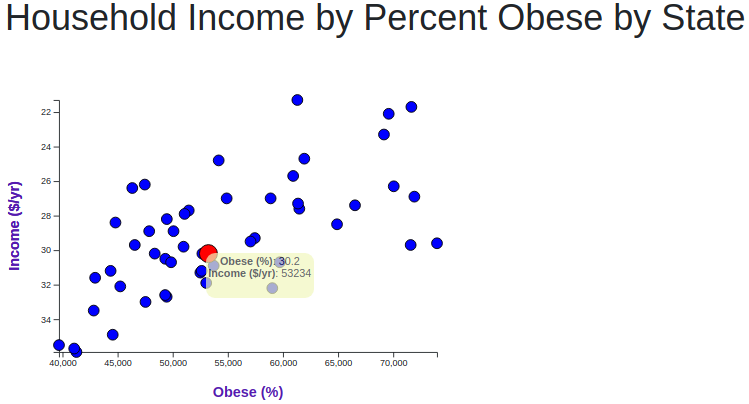

# D3 Challenge


## Summary:
This project visualizes the relationship between health-related risk factors at the state level using Javascript.The data set is based on 2014 ACS 1-year estimates, including data on rates of income, obesity, poverty, etc. by state. 

## The Files:
```
+-- D3\_data_journalism<
|   +-- index.html
|   +-- static
|       +--css
|          +-- d3Style.css = style sheet for d3-related visualization
|          +-- style.css = second style sheet for everything else
|       +-- data
|          +--data.csv = csv file of state data
|   +--js
|       +--app.js = javascript code
```

## Vizualization Preview:

 
